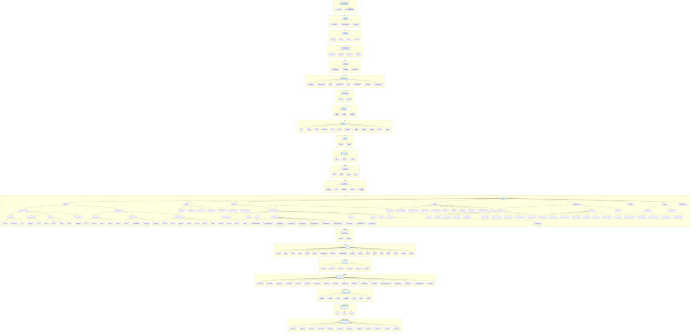

```mermaid
flowchart LR
    classDef root fill:#e8f0fe,stroke:#1a73e8,stroke-width:3px
    classDef truncation fill:#f5f5f5,stroke:#9e9e9e,stroke-dasharray:5 5
    subgraph nb0["Aspect Harmonic"]
        n0["Aspect Harmonic"]
        n1["Harmonic 4"]
        n34["Harmonic 3"]
        n43["Harmonic 6"]
        n46["Harmonic 12"]
        n70["Harmonic 1"]
        n76["Harmonic 2"]
        n83["Harmonic 10"]
        n103["Harmonic 9"]
        n105["Harmonic 5"]
        n111["Harmonic 8"]
        n130["Harmonic 7"]
        n137["Harmonic 11"]
        n0 --> n1
        n0 --> n34
        n0 --> n43
        n0 --> n46
        n0 --> n70
        n0 --> n76
        n0 --> n83
        n0 --> n103
        n0 --> n105
        n0 --> n111
        n0 --> n130
        n0 --> n137
    end
    subgraph nb1["Aspect Nature"]
        n2["Aspect Nature"]
        n3["Hard"]
        n35["Soft"]
        n47["Neutral"]
        n2 --> n3
        n2 --> n35
        n2 --> n47
    end
    subgraph nb2["Body Class"]
        n4["Body Class"]
        n5["Asteroid"]
        n6["Luminary"]
        n7["Outer"]
        n23["Personal"]
        n36["Point"]
        n48["Node"]
        n90["Social"]
        n4 --> n5
        n4 --> n6
        n4 --> n7
        n4 --> n23
        n4 --> n36
        n4 --> n48
        n4 --> n90
    end
    subgraph nb3["Focal Body"]
        n8["Focal Body"]
        n9["Chiron Focal"]
        n24["Venus Focal"]
        n27["Moon Focal"]
        n28["Ceres Focal"]
        n30["Juno Focal"]
        n44["Pluto Focal"]
        n74["Uranus Focal"]
        n81["Lilith Focal"]
        n89["Sun Focal"]
        n147["Saturn Focal"]
        n148["Vesta Focal"]
        n150["Neptune Focal"]
        n151["Pallas Focal"]
        n154["North Lunar Node Focal"]
        n164["Mercury Focal"]
        n173["Jupiter Focal"]
        n183["Lunar Apogee Focal"]
        n186["Mars Focal"]
        n8 --> n9
        n8 --> n24
        n8 --> n27
        n8 --> n28
        n8 --> n30
        n8 --> n44
        n8 --> n74
        n8 --> n81
        n8 --> n89
        n8 --> n147
        n8 --> n148
        n8 --> n150
        n8 --> n151
        n8 --> n154
        n8 --> n164
        n8 --> n173
        n8 --> n183
        n8 --> n186
    end
    subgraph nb4["Phase"]
        n10["Phase"]
        n11["Forming"]
        n49["Dissolving"]
        n77["Perfective"]
        n210["Beginning"]
        n214["Maximum"]
        n215["Ending"]
        n10 --> n11
        n10 --> n49
        n10 --> n77
        n10 --> n210
        n10 --> n214
        n10 --> n215
    end
    subgraph nb5["Planet"]
        n12["Planet"]
        n13["Chiron"]
        n14["Moon"]
        n15["Pluto"]
        n25["Juno"]
        n26["Venus"]
        n29["Ceres"]
        n37["Lunar Apogee"]
        n41["Neptune"]
        n50["North Lunar Node"]
        n72["Uranus"]
        n75["Pallas"]
        n80["Lilith"]
        n84["Vesta"]
        n87["Sun"]
        n88["Mars"]
        n91["Saturn"]
        n110["Mercury"]
        n129["Jupiter"]
        n12 --> n13
        n12 --> n14
        n12 --> n15
        n12 --> n25
        n12 --> n26
        n12 --> n29
        n12 --> n37
        n12 --> n41
        n12 --> n50
        n12 --> n72
        n12 --> n75
        n12 --> n80
        n12 --> n84
        n12 --> n87
        n12 --> n88
        n12 --> n91
        n12 --> n110
        n12 --> n129
    end
    subgraph nb6["Temporality"]
        n16["Temporality"]
        n17["Instant"]
        n33["Duration"]
        n16 --> n17
        n16 --> n33
    end
    subgraph nb7["Type"]
        n18["Type"]
        n19["Aspect"]
        n20["Compound Aspect"]
        n21["Triple Aspect"]
        n22["T Square"]
        n31["Quadruple Aspect"]
        n32["Grand Cross"]
        n38["Simple Aspect"]
        n39["Major Aspect"]
        n40["Trine"]
        n42["Grand Trine"]
        n45["Kite"]
        n51["Minor Aspect"]
        n52["Quincunx"]
        n63["Ingress"]
        n64["Sign Ingress"]
        n65["Sign Transit"]
        n68["Cycle"]
        n69["Daily Solar Cycle"]
        n71["Conjunct"]
        n73["Sextile"]
        n78["Opposite"]
        n79["Square"]
        n82["Yod"]
        n85["Specialty Aspect"]
        n86["Tredecile"]
        n92["Twilight"]
        n93["Astronomical Dawn"]
        n96["Astronomical Twilight"]
        n97["Nautical Dawn"]
        n98["Nautical Twilight"]
        n100["Daily Lunar Cycle"]
        n101["Civil Dawn"]
        n102["Daylight"]
        n104["Novile"]
        n106["Biquintile"]
        n109["Monthly Lunar Cycle"]
        n112["Sesquiquadrate"]
        n115["Decan Ingress"]
        n116["Civil Dusk"]
        n118["Nautical Dusk"]
        n122["Planetary Phase"]
        n123["Mercurian"]
        n124["Evening Set"]
        n125["Astronomical Dusk"]
        n126["Night"]
        n127["Quintile"]
        n128["Peak Ingress"]
        n131["Septile"]
        n136["Semisextile"]
        n138["Undecile"]
        n139["Semisquare"]
        n140["Decile"]
        n156["Morning Rise"]
        n160["Annual Solar Cycle"]
        n161["Cross-Quarter Day"]
        n162["Samhain"]
        n170["Direction"]
        n171["Lunar Apsides"]
        n172["Apogee"]
        n175["Perigee"]
        n179["Perihelion"]
        n180["Retreating"]
        n184["Stellium"]
        n185["4 Body"]
        n188["Morning Set"]
        n190["Hexadecan"]
        n191["Thirteenth Hexadecan"]
        n193["5 Body"]
        n194["6 Body"]
        n195["7 Body"]
        n199["Evening Rise"]
        n201["Evening Visibility"]
        n202["Venusian"]
        n203["Evening Rise"]
        n204["Evening Visibility"]
        n205["Martian"]
        n206["Morning Rise"]
        n207["Imbolc"]
        n211["Eclipse"]
        n212["Solar Eclipse"]
        n213["Annular Solar Eclipse"]
        n217["Eastern Elongation"]
        n218["Fifteenth Hexadecan"]
        n221["Retrograde Period"]
        n222["Lunar Eclipse"]
        n223["Total Lunar Eclipse"]
        n225["Morning Visibility"]
        n227["Equinox"]
        n228["Vernal Equinox"]
        n229["Western Elongation"]
        n230["First Hexadecan"]
        n231["Beltane"]
        n232["Third Hexadecan"]
        n234["Solstice"]
        n235["Summer Solstice"]
        n236["Sextuple Aspect"]
        n237["Hexagram"]
        n238["Aphelion"]
        n239["Fifth Hexadecan"]
        n240["Lammas"]
        n241["Total Solar Eclipse"]
        n242["Partial Solar Eclipse"]
        n243["Eastern Elongation"]
        n244["Partial Lunar Eclipse"]
        n245["Seventh Hexadecan"]
        n246["Autumnal Equinox"]
        n248["Eastern Brightest"]
        n249["Ninth Hexadecan"]
        n250["Evening Set"]
        n251["Morning Rise"]
        n252["Western Brightest"]
        n253["Eleventh Hexadecan"]
        n254["Western Brightest"]
        n255["Winter Solstice"]
        n18 --> n19
        n19 --> n20
        n20 --> n21
        n21 --> n22
        n20 --> n31
        n31 --> n32
        n19 --> n38
        n38 --> n39
        n39 --> n40
        n21 --> n42
        n31 --> n45
        n38 --> n51
        n51 --> n52
        n18 --> n63
        n63 --> n64
        n63 --> n65
        n18 --> n68
        n68 --> n69
        n39 --> n71
        n39 --> n73
        n39 --> n78
        n39 --> n79
        n21 --> n82
        n38 --> n85
        n85 --> n86
        n18 --> n92
        n92 --> n93
        n92 --> n96
        n92 --> n97
        n92 --> n98
        n68 --> n100
        n92 --> n101
        n92 --> n102
        n85 --> n104
        n85 --> n106
        n68 --> n109
        n51 --> n112
        n63 --> n115
        n92 --> n116
        n92 --> n118
        n18 --> n122
        n122 --> n123
        n123 --> n124
        n92 --> n125
        n92 --> n126
        n85 --> n127
        n63 --> n128
        n85 --> n131
        n51 --> n136
        n85 --> n138
        n51 --> n139
        n85 --> n140
        n123 --> n156
        n68 --> n160
        n160 --> n161
        n161 --> n162
        n18 --> n170
        n68 --> n171
        n171 --> n172
        n171 --> n175
        n160 --> n179
        n160 --> n180
        n20 --> n184
        n184 --> n185
        n123 --> n188
        n160 --> n190
        n190 --> n191
        n184 --> n193
        n184 --> n194
        n184 --> n195
        n123 --> n199
        n123 --> n201
        n122 --> n202
        n202 --> n203
        n202 --> n204
        n122 --> n205
        n205 --> n206
        n161 --> n207
        n18 --> n211
        n211 --> n212
        n212 --> n213
        n123 --> n217
        n190 --> n218
        n18 --> n221
        n211 --> n222
        n222 --> n223
        n123 --> n225
        n160 --> n227
        n227 --> n228
        n123 --> n229
        n190 --> n230
        n161 --> n231
        n190 --> n232
        n160 --> n234
        n234 --> n235
        n20 --> n236
        n236 --> n237
        n160 --> n238
        n190 --> n239
        n161 --> n240
        n212 --> n241
        n212 --> n242
        n202 --> n243
        n222 --> n244
        n190 --> n245
        n227 --> n246
        n202 --> n248
        n190 --> n249
        n202 --> n250
        n202 --> n251
        n202 --> n252
        n190 --> n253
        n123 --> n254
        n234 --> n255
    end
    subgraph nb8["Dignity"]
        n53["Dignity"]
        n54["Peregrine"]
        n163["Fall"]
        n166["Detriment"]
        n176["Domicile"]
        n181["Exaltation"]
        n53 --> n54
        n53 --> n163
        n53 --> n166
        n53 --> n176
        n53 --> n181
    end
    subgraph nb9["Element"]
        n55["Element"]
        n56["Fire"]
        n132["Water"]
        n141["Earth"]
        n152["Air"]
        n55 --> n56
        n55 --> n132
        n55 --> n141
        n55 --> n152
    end
    subgraph nb10["Modality"]
        n57["Modality"]
        n58["Fixed"]
        n142["Mutable"]
        n145["Cardinal"]
        n57 --> n58
        n57 --> n142
        n57 --> n145
    end
    subgraph nb11["Polarity"]
        n59["Polarity"]
        n60["Positive"]
        n133["Negative"]
        n59 --> n60
        n59 --> n133
    end
    subgraph nb12["Sign"]
        n61["Sign"]
        n62["Leo"]
        n134["Scorpio"]
        n143["Virgo"]
        n144["Sagittarius"]
        n146["Aries"]
        n153["Libra"]
        n157["Capricorn"]
        n174["Gemini"]
        n177["Cancer"]
        n187["Aquarius"]
        n192["Pisces"]
        n196["Taurus"]
        n61 --> n62
        n61 --> n134
        n61 --> n143
        n61 --> n144
        n61 --> n146
        n61 --> n153
        n61 --> n157
        n61 --> n174
        n61 --> n177
        n61 --> n187
        n61 --> n192
        n61 --> n196
    end
    subgraph nb13["Domain"]
        n66["Domain"]
        n67["Solar"]
        n99["Lunar"]
        n119["Planetary"]
        n66 --> n67
        n66 --> n99
        n66 --> n119
    end
    subgraph nb14["Time of Day"]
        n94["Time of Day"]
        n95["Morning"]
        n117["Evening"]
        n94 --> n95
        n94 --> n117
    end
    subgraph nb15["Lunar Phase"]
        n107["Lunar Phase"]
        n108["Last Quarter"]
        n149["Waning Crescent"]
        n165["New"]
        n167["Waxing Crescent"]
        n178["Full"]
        n182["Waning Gibbous"]
        n197["First Quarter"]
        n198["Waxing Gibbous"]
        n107 --> n108
        n107 --> n149
        n107 --> n165
        n107 --> n167
        n107 --> n178
        n107 --> n182
        n107 --> n197
        n107 --> n198
    end
    subgraph nb16["Decan"]
        n113["Decan"]
        n114["Second Decan"]
        n135["Third Decan"]
        n155["First Decan"]
        n113 --> n114
        n113 --> n135
        n113 --> n155
    end
    subgraph nb17["Synodic Stage"]
        n120["Synodic Stage"]
        n121["Rise and set"]
        n200["Visibility"]
        n216["Elongation"]
        n247["Brightest"]
        n120 --> n121
        n120 --> n200
        n120 --> n216
        n120 --> n247
    end
    subgraph nb18["Season"]
        n158["Season"]
        n159["Autumn"]
        n189["Winter"]
        n226["Spring"]
        n233["Summer"]
        n158 --> n159
        n158 --> n189
        n158 --> n226
        n158 --> n233
    end
    subgraph nb19["Motion"]
        n168["Motion"]
        n169["Station Direct"]
        n219["Station Retrograde"]
        n220["Retrograde"]
        n168 --> n169
        n168 --> n219
        n168 --> n220
    end
    subgraph nb20["Eclipse Frame"]
        n208["Eclipse Frame"]
        n209["Geocentric"]
        n224["Topocentric Visibility"]
        n208 --> n209
        n208 --> n224
    end
    class n0 root
    class n2 root
    class n4 root
    class n8 root
    class n10 root
    class n12 root
    class n16 root
    class n18 root
    class n53 root
    class n55 root
    class n57 root
    class n59 root
    class n61 root
    class n66 root
    class n94 root
    class n107 root
    class n113 root
    class n120 root
    class n158 root
    class n168 root
    class n208 root
```
