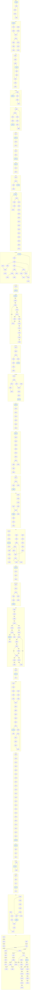
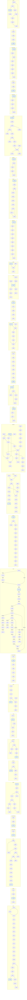

## Page 1 of 2

```mermaid
flowchart LR
    classDef root fill:#e8f0fe,stroke:#1a73e8,stroke-width:3px
    classDef truncation fill:#f5f5f5,stroke:#9e9e9e,stroke-dasharray:5 5
    subgraph nb0["1067"]
        n0["677"]
        n1["1067"]
        n2["113963"]
        n5["2912"]
        n6["116631"]
        n7["3031"]
        n8["3092"]
        n12["3693"]
        n13["3881"]
        n14["5434"]
        n16["4436"]
        n17["4463"]
        n19["7607"]
        n20["5447"]
        n29["9640"]
        n308["109176"]
        n309["107354"]
        n310["109410"]
        n311["112158"]
        n312["109427"]
        n313["107315"]
        n314["112029"]
        n315["113881"]
        n316["112440"]
        n317["112447"]
        n318["112748"]
        n319["113726"]
        n320["116805"]
        n321["116584"]
        n322["117221"]
        n0 ---|"Pegasus"| n1
        n1 ---|"Pegasus"| n2
        n5 ---|"Andromeda"| n6
        n7 ---|"Andromeda"| n8
        n8 ---|"Andromeda"| n0
        n8 ---|"Andromeda"| n5
        n12 ---|"Andromeda"| n7
        n13 ---|"Andromeda"| n14
        n16 ---|"Andromeda"| n13
        n17 ---|"Andromeda"| n12
        n14 ---|"Andromeda"| n19
        n20 ---|"Andromeda"| n8
        n20 ---|"Andromeda"| n16
        n29 ---|"Andromeda"| n20
        n308 ---|"Pegasus"| n309
        n310 ---|"Pegasus"| n311
        n312 ---|"Pegasus"| n313
        n314 ---|"Pegasus"| n312
        n311 ---|"Pegasus"| n315
        n316 ---|"Pegasus"| n308
        n317 ---|"Pegasus"| n314
        n318 ---|"Pegasus"| n316
        n315 ---|"Pegasus"| n0
        n315 ---|"Pegasus"| n318
        n2 ---|"Pegasus"| n317
        n2 ---|"Pegasus"| n315
        n6 ---|"Andromeda"| n319
        n6 ---|"Andromeda"| n320
        n320 ---|"Andromeda"| n321
        n320 ---|"Andromeda"| n322
    end
    subgraph nb1["Cetus"]
        n3["1562"]
        n4["5364"]
        n11["3419"]
        n18["6537"]
        n21["8645"]
        n23["8102"]
        n32["10826"]
        n33["11484"]
        n34["12828"]
        n35["12093"]
        n36["12387"]
        n37["12706"]
        n42["13954"]
        n56["14135"]
        n3 --- n4
        n11 --- n3
        n4 --- n18
        n18 --- n21
        n23 --- n11
        n21 --- n23
        n32 --- n21
        n33 --- n34
        n35 --- n33
        n36 --- n32
        n37 --- n35
        n37 --- n36
        n34 --- n42
        n42 --- n56
        n56 --- n37
    end
    subgraph nb2["Cassiopeia"]
        n9["3179"]
        n10["746"]
        n15["4427"]
        n22["6686"]
        n26["8886"]
        n9 --- n10
        n15 --- n9
        n22 --- n15
        n26 --- n22
    end
    subgraph nb3["Triangulum"]
        n24["8796"]
        n25["10064"]
        n31["10670"]
        n24 --- n25
        n25 --- n31
        n31 --- n24
    end
    subgraph nb4["Aries"]
        n27["8903"]
        n28["8832"]
        n30["9884"]
        n46["13209"]
        n27 --- n28
        n30 --- n27
        n46 --- n30
    end
    subgraph nb5["Eridanus"]
        n38["12770"]
        n39["12843"]
        n43["14146"]
        n50["13701"]
        n51["13847"]
        n52["12486"]
        n57["15474"]
        n63["16611"]
        n64["15510"]
        n70["16537"]
        n71["17651"]
        n73["16870"]
        n75["17378"]
        n79["17593"]
        n80["21393"]
        n81["17874"]
        n87["18543"]
        n92["19587"]
        n93["20042"]
        n97["20535"]
        n103["21444"]
        n106["22109"]
        n126["23875"]
        n38 --- n39
        n39 --- n43
        n50 --- n38
        n51 --- n52
        n43 --- n57
        n57 --- n63
        n64 --- n51
        n70 --- n50
        n63 --- n71
        n73 --- n64
        n75 --- n70
        n79 --- n75
        n71 --- n80
        n81 --- n73
        n87 --- n79
        n92 --- n87
        n93 --- n81
        n97 --- n93
        n80 --- n97
        n103 --- n92
        n106 --- n103
        n126 --- n106
    end
    subgraph nb6["Perseus"]
        n40["12777"]
        n41["8068"]
        n47["13268"]
        n48["13531"]
        n49["14632"]
        n53["13879"]
        n54["13949"]
        n55["14576"]
        n58["14328"]
        n59["14354"]
        n60["14817"]
        n61["14668"]
        n65["15863"]
        n72["16826"]
        n74["17358"]
        n76["17448"]
        n77["18246"]
        n78["17529"]
        n85["18614"]
        n86["18532"]
        n89["19167"]
        n90["19812"]
        n91["19343"]
        n40 --- n41
        n47 --- n48
        n48 --- n49
        n53 --- n54
        n54 --- n55
        n58 --- n47
        n59 --- n53
        n55 --- n60
        n49 --- n40
        n49 --- n61
        n61 --- n55
        n60 --- n59
        n65 --- n58
        n72 --- n65
        n74 --- n72
        n76 --- n77
        n78 --- n74
        n77 --- n85
        n86 --- n78
        n85 --- n86
        n89 --- n90
        n91 --- n74
        n90 --- n91
    end
    subgraph nb7["Fornax"]
        n44["13147"]
        n45["9677"]
        n62["14879"]
        n44 --- n45
        n62 --- n44
    end
    subgraph nb8["15900"]
        n66["15900"]
        n67["16852"]
        n68["16083"]
        n69["18907"]
        n88["18724"]
        n94["20205"]
        n95["20455"]
        n96["20889"]
        n98["25428"]
        n99["20894"]
        n102["21421"]
        n116["23015"]
        n120["23416"]
        n121["23453"]
        n125["23767"]
        n132["24608"]
        n136["28380"]
        n141["26451"]
        n153["28358"]
        n154["28360"]
        n66 ---|"Taurus"| n67
        n68 ---|"Taurus"| n66
        n68 ---|"Taurus"| n69
        n88 ---|"Taurus"| n68
        n94 ---|"Taurus"| n88
        n94 ---|"Taurus"| n95
        n95 ---|"Taurus"| n96
        n96 ---|"Taurus"| n98
        n99 ---|"Taurus"| n94
        n102 ---|"Taurus"| n99
        n116 ---|"Auriga"| n98
        n120 ---|"Auriga"| n121
        n125 ---|"Auriga"| n116
        n132 ---|"Auriga"| n120
        n132 ---|"Auriga"| n125
        n98 ---|"Auriga"| n136
        n141 ---|"Taurus"| n102
        n153 ---|"Auriga"| n132
        n154 ---|"Auriga"| n132
        n154 ---|"Auriga"| n153
        n136 ---|"Auriga"| n154
    end
    subgraph nb9["Camelopardalis"]
        n82["17884"]
        n83["16228"]
        n84["17959"]
        n111["22783"]
        n112["29997"]
        n117["23040"]
        n118["23522"]
        n161["33694"]
        n82 --- n83
        n84 --- n82
        n111 --- n84
        n111 --- n112
        n117 --- n118
        n118 --- n111
        n112 --- n161
    end
    subgraph nb10["Caelum"]
        n100["21060"]
        n101["21770"]
        n104["21861"]
        n105["23595"]
        n100 --- n101
        n101 --- n104
        n104 --- n105
    end
    subgraph nb11["Orion"]
        n107["22449"]
        n108["22509"]
        n109["22845"]
        n110["22549"]
        n113["22797"]
        n114["22957"]
        n115["23607"]
        n119["23123"]
        n122["24010"]
        n130["24436"]
        n131["25281"]
        n133["25930"]
        n134["25336"]
        n135["26207"]
        n139["27989"]
        n140["26311"]
        n144["26727"]
        n145["27366"]
        n150["27913"]
        n151["28716"]
        n155["28614"]
        n156["29426"]
        n158["29038"]
        n107 --- n108
        n108 --- n109
        n110 --- n107
        n113 --- n110
        n109 --- n114
        n114 --- n115
        n119 --- n113
        n115 --- n122
        n130 --- n131
        n131 --- n133
        n134 --- n109
        n134 --- n135
        n133 --- n134
        n135 --- n139
        n140 --- n133
        n144 --- n140
        n144 --- n145
        n150 --- n151
        n139 --- n134
        n139 --- n144
        n155 --- n139
        n151 --- n156
        n158 --- n150
        n156 --- n155
    end
    subgraph nb12["Lepus"]
        n123["23685"]
        n124["25606"]
        n127["24305"]
        n128["24845"]
        n129["24327"]
        n137["27072"]
        n138["25985"]
        n146["27654"]
        n147["27288"]
        n152["28103"]
        n157["28910"]
        n123 --- n124
        n127 --- n123
        n127 --- n128
        n129 --- n127
        n124 --- n137
        n138 --- n127
        n137 --- n146
        n147 --- n138
        n152 --- n147
        n157 --- n152
    end
    subgraph nb13["Columba"]
        n142["26634"]
        n143["25859"]
        n148["27628"]
        n149["28328"]
        n164["30277"]
        n142 --- n143
        n148 --- n142
        n148 --- n149
        n164 --- n148
    end
    subgraph nb14["Gemini"]
        n159["29655"]
        n160["30343"]
        n167["32246"]
        n173["31681"]
        n174["32362"]
        n177["34693"]
        n188["34088"]
        n189["36850"]
        n192["35550"]
        n193["35350"]
        n196["37826"]
        n198["36962"]
        n159 --- n160
        n160 --- n167
        n173 --- n174
        n167 --- n177
        n188 --- n173
        n177 --- n189
        n192 --- n188
        n192 --- n193
        n189 --- n196
        n198 --- n192
        n196 --- n198
    end
    subgraph nb15["Lynx"]
        n162["30060"]
        n163["33449"]
        n183["36145"]
        n195["41075"]
        n210["44248"]
        n227["45688"]
        n231["45860"]
        n162 --- n163
        n163 --- n183
        n183 --- n195
        n195 --- n210
        n210 --- n227
        n227 --- n231
    end
    subgraph nb16["Canis Major"]
        n165["30324"]
        n166["32349"]
        n178["33347"]
        n179["33977"]
        n181["33160"]
        n182["34045"]
        n184["33579"]
        n185["30122"]
        n186["33856"]
        n187["34444"]
        n194["35904"]
        n165 --- n166
        n166 --- n178
        n166 --- n179
        n181 --- n178
        n178 --- n182
        n184 --- n185
        n186 --- n184
        n179 --- n187
        n182 --- n181
        n187 --- n186
        n194 --- n187
    end
    subgraph nb17["Monoceros"]
        n168["30419"]
        n169["31216"]
        n170["30867"]
        n171["29651"]
        n172["31978"]
        n180["32578"]
        n190["34769"]
        n202["37447"]
        n203["39863"]
        n168 --- n169
        n170 --- n171
        n169 --- n172
        n180 --- n168
        n190 --- n170
        n190 --- n180
        n202 --- n203
        n203 --- n190
    end
    subgraph nb18["31685"]
        n175["31685"]
        n176["35264"]
        n191["36917"]
        n197["37229"]
        n199["38170"]
        n204["37677"]
        n205["38070"]
        n206["38835"]
        n207["39757"]
        n208["39429"]
        n209["42515"]
        n216["42828"]
        n220["43409"]
        n175 ---|"Puppis"| n176
        n176 ---|"Puppis"| n191
        n191 ---|"Puppis"| n197
        n197 ---|"Puppis"| n199
        n204 ---|"Puppis"| n191
        n205 ---|"Puppis"| n204
        n199 ---|"Puppis"| n205
        n199 ---|"Puppis"| n206
        n206 ---|"Puppis"| n207
        n208 ---|"Pyxis"| n209
        n207 ---|"Puppis"| n208
        n209 ---|"Pyxis"| n216
        n216 ---|"Pyxis"| n220
    end
    subgraph nb19["Canis Minor"]
        n200["37279"]
        n201["36188"]
        n200 --- n201
    end
    subgraph nb20["Ursa Major"]
        n211["41704"]
        n212["48319"]
        n228["44471"]
        n229["46853"]
        n238["46733"]
        n239["44127"]
        n240["53910"]
        n242["48402"]
        n266["58001"]
        n267["54061"]
        n268["54539"]
        n269["50372"]
        n270["50801"]
        n283["57399"]
        n284["55219"]
        n287["59774"]
        n291["62956"]
        n296["65378"]
        n302["67301"]
        n211 --- n212
        n228 --- n229
        n238 --- n211
        n229 --- n239
        n212 --- n240
        n242 --- n229
        n240 --- n242
        n240 --- n266
        n267 --- n238
        n267 --- n240
        n268 --- n269
        n268 --- n270
        n283 --- n268
        n283 --- n284
        n266 --- n283
        n266 --- n287
        n287 --- n267
        n287 --- n291
        n291 --- n296
        n296 --- n302
    end
    subgraph nb21["Hydra"]
        n213["42313"]
        n214["43109"]
        n215["42402"]
        n217["42799"]
        n223["43234"]
        n224["43813"]
        n225["45336"]
        n230["47431"]
        n232["46390"]
        n233["48356"]
        n241["49841"]
        n254["51069"]
        n259["52943"]
        n263["56343"]
        n278["57936"]
        n286["64962"]
        n301["68895"]
        n306["72571"]
        n213 --- n214
        n215 --- n213
        n217 --- n215
        n214 --- n223
        n214 --- n224
        n223 --- n217
        n224 --- n225
        n225 --- n230
        n232 --- n233
        n230 --- n232
        n233 --- n241
        n241 --- n254
        n254 --- n259
        n259 --- n263
        n263 --- n278
        n278 --- n286
        n286 --- n301
        n301 --- n306
    end
    subgraph nb22["Cancer"]
        n218["42806"]
        n219["43100"]
        n221["42911"]
        n222["40526"]
        n226["44066"]
        n218 --- n219
        n221 --- n222
        n221 --- n218
        n226 --- n221
    end
    subgraph nb23["Antlia"]
        n234["46515"]
        n235["51172"]
        n260["53502"]
        n234 --- n235
        n235 --- n260
    end
    subgraph nb24["Vela"]
        n236["46651"]
        n237["44816"]
        n255["50191"]
        n236 --- n237
        n255 --- n236
    end
    subgraph nb25["Sextans"]
        n243["48437"]
        n244["51362"]
        n252["49641"]
        n262["51437"]
        n243 --- n244
        n252 --- n243
        n244 --- n262
    end
    subgraph nb26["Leo"]
        n245["48455"]
        n246["47908"]
        n247["49583"]
        n248["50583"]
        n253["49669"]
        n256["50335"]
        n257["54872"]
        n272["57632"]
        n273["54879"]
        n245 --- n246
        n247 --- n248
        n253 --- n247
        n256 --- n245
        n248 --- n256
        n248 --- n257
        n257 --- n272
        n273 --- n253
        n272 --- n273
    end
    subgraph nb27["Leo Minor"]
        n249["49593"]
        n250["46952"]
        n251["51056"]
        n258["53229"]
        n261["51233"]
        n249 --- n250
        n249 --- n251
        n251 --- n258
        n261 --- n249
        n258 --- n261
    end
    subgraph nb28["Crater"]
        n264["53740"]
        n265["54682"]
        n271["55598"]
        n274["55282"]
        n275["55705"]
        n276["55687"]
        n277["57283"]
        n279["56633"]
        n280["58188"]
        n264 --- n265
        n265 --- n271
        n274 --- n264
        n274 --- n275
        n271 --- n275
        n276 --- n274
        n275 --- n277
        n279 --- n276
        n277 --- n280
    end
    subgraph nb29["Virgo"]
        n281["57380"]
        n282["57757"]
        n285["60129"]
        n293["61941"]
        n295["64238"]
        n297["63090"]
        n298["63608"]
        n299["65474"]
        n300["66249"]
        n303["69701"]
        n304["68520"]
        n305["72220"]
        n307["71957"]
        n281 --- n282
        n282 --- n285
        n285 --- n293
        n293 --- n295
        n297 --- n293
        n298 --- n297
        n295 --- n299
        n295 --- n300
        n299 --- n303
        n300 --- n304
        n304 --- n305
        n303 --- n307
    end
    subgraph nb30["Corvus"]
        n288["59199"]
        n289["59316"]
        n290["59803"]
        n292["60965"]
        n294["61359"]
        n288 --- n289
        n289 --- n290
        n290 --- n292
        n292 --- n294
        n294 --- n289
    end
    class n1 root
    class n9 root
    class n25 root
    class n32 root
    class n40 root
    class n44 root
    class n46 root
    class n52 root
    class n66 root
    class n83 root
    class n100 root
    class n107 root
    class n123 root
    class n143 root
    class n159 root
    class n162 root
    class n171 root
    class n175 root
    class n185 root
    class n201 root
    class n211 root
    class n213 root
    class n222 root
    class n234 root
    class n237 root
    class n243 root
    class n246 root
    class n250 root
    class n264 root
    class n281 root
    class n288 root
```

## Page 2 of 2

```mermaid
flowchart LR
    classDef root fill:#e8f0fe,stroke:#1a73e8,stroke-width:3px
    classDef truncation fill:#f5f5f5,stroke:#9e9e9e,stroke-dasharray:5 5
    subgraph nb0["Pisces"]
        n0["3786"]
        n1["118268"]
        n4["4906"]
        n5["5571"]
        n6["7097"]
        n7["5586"]
        n8["6193"]
        n9["5737"]
        n10["5742"]
        n11["7007"]
        n12["8198"]
        n13["7884"]
        n14["9487"]
        n15["8833"]
        n276["114971"]
        n277["113889"]
        n278["115738"]
        n283["115227"]
        n285["116928"]
        n286["115830"]
        n287["116771"]
        n288["117245"]
        n0 --- n1
        n4 --- n0
        n5 --- n6
        n7 --- n8
        n9 --- n4
        n10 --- n5
        n10 --- n7
        n8 --- n10
        n11 --- n9
        n6 --- n12
        n13 --- n11
        n12 --- n14
        n15 --- n13
        n14 --- n15
        n276 --- n277
        n276 --- n278
        n283 --- n276
        n278 --- n285
        n286 --- n283
        n287 --- n286
        n285 --- n288
        n288 --- n287
        n1 --- n287
    end
    subgraph nb1["Sculptor"]
        n2["4577"]
        n3["117452"]
        n281["115102"]
        n282["116231"]
        n2 --- n3
        n281 --- n282
        n3 --- n281
    end
    subgraph nb2["Draco"]
        n16["61281"]
        n17["56211"]
        n30["68756"]
        n54["75458"]
        n82["78527"]
        n91["80331"]
        n111["83895"]
        n119["85670"]
        n120["85829"]
        n122["87585"]
        n131["87833"]
        n132["94376"]
        n140["89908"]
        n141["89937"]
        n175["97433"]
        n16 --- n17
        n30 --- n16
        n54 --- n30
        n82 --- n54
        n91 --- n82
        n111 --- n91
        n119 --- n120
        n120 --- n122
        n122 --- n131
        n122 --- n132
        n131 --- n119
        n140 --- n111
        n140 --- n141
        n132 --- n140
        n132 --- n175
    end
    subgraph nb3["Canes Venatici"]
        n18["63121"]
        n19["61317"]
        n18 --- n19
    end
    subgraph nb4["Coma Berenices"]
        n20["64241"]
        n21["64394"]
        n22["60742"]
        n20 --- n21
        n21 --- n22
    end
    subgraph nb5["Boötes"]
        n23["67275"]
        n24["67927"]
        n29["69673"]
        n32["69481"]
        n33["70497"]
        n34["71053"]
        n35["71795"]
        n36["69732"]
        n37["71075"]
        n38["73555"]
        n40["72105"]
        n46["74666"]
        n23 --- n24
        n24 --- n29
        n32 --- n33
        n29 --- n34
        n29 --- n35
        n36 --- n32
        n33 --- n36
        n34 --- n37
        n37 --- n36
        n37 --- n38
        n40 --- n29
        n38 --- n46
        n46 --- n40
    end
    subgraph nb6["Centaurus"]
        n25["67464"]
        n26["65109"]
        n27["68933"]
        n28["67472"]
        n31["71352"]
        n39["73334"]
        n25 --- n26
        n25 --- n27
        n28 --- n25
        n27 --- n31
        n31 --- n39
    end
    subgraph nb7["Ursa Minor"]
        n41["72607"]
        n42["77055"]
        n48["75097"]
        n68["79822"]
        n69["82080"]
        n105["85822"]
        n121["11767"]
        n41 --- n42
        n48 --- n41
        n42 --- n68
        n42 --- n69
        n68 --- n48
        n69 --- n105
        n105 --- n121
    end
    subgraph nb8["Libra"]
        n43["72622"]
        n44["74785"]
        n45["76333"]
        n47["73714"]
        n62["76470"]
        n63["76600"]
        n43 --- n44
        n43 --- n45
        n47 --- n43
        n44 --- n45
        n45 --- n62
        n62 --- n63
    end
    subgraph nb9["Lupus"]
        n49["75141"]
        n50["73273"]
        n51["76297"]
        n52["75177"]
        n53["75264"]
        n61["78384"]
        n64["76705"]
        n75["77634"]
        n79["78918"]
        n49 --- n50
        n49 --- n51
        n52 --- n49
        n53 --- n51
        n51 --- n61
        n64 --- n52
        n75 --- n64
        n61 --- n79
    end
    subgraph nb10["Corona Borealis"]
        n55["75695"]
        n56["76267"]
        n57["76127"]
        n58["76952"]
        n67["77512"]
        n73["78159"]
        n76["78493"]
        n55 --- n56
        n57 --- n55
        n56 --- n58
        n58 --- n67
        n67 --- n73
        n73 --- n76
    end
    subgraph nb11["76276"]
        n59["76276"]
        n60["77070"]
        n65["76852"]
        n66["77450"]
        n70["77622"]
        n71["77233"]
        n72["78072"]
        n74["79593"]
        n85["79882"]
        n86["81377"]
        n92["80343"]
        n93["80473"]
        n94["80569"]
        n97["80883"]
        n98["80894"]
        n101["84012"]
        n109["83000"]
        n112["84970"]
        n113["86263"]
        n117["85423"]
        n123["86032"]
        n125["88048"]
        n128["86742"]
        n130["87108"]
        n135["88404"]
        n136["89962"]
        n144["92946"]
        n59 ---|"Serpens"| n60
        n65 ---|"Serpens"| n66
        n60 ---|"Serpens"| n70
        n71 ---|"Serpens"| n59
        n71 ---|"Serpens"| n65
        n66 ---|"Serpens"| n72
        n70 ---|"Serpens"| n74
        n72 ---|"Serpens"| n71
        n74 ---|"Ophiuchus"| n85
        n85 ---|"Ophiuchus"| n86
        n92 ---|"Ophiuchus"| n93
        n94 ---|"Ophiuchus"| n92
        n97 ---|"Ophiuchus"| n74
        n98 ---|"Ophiuchus"| n94
        n86 ---|"Ophiuchus"| n98
        n86 ---|"Ophiuchus"| n101
        n109 ---|"Ophiuchus"| n97
        n109 ---|"Ophiuchus"| n86
        n101 ---|"Ophiuchus"| n112
        n101 ---|"Serpens"| n113
        n112 ---|"Ophiuchus"| n117
        n123 ---|"Ophiuchus"| n109
        n113 ---|"Serpens"| n125
        n128 ---|"Ophiuchus"| n101
        n128 ---|"Ophiuchus"| n123
        n130 ---|"Ophiuchus"| n128
        n125 ---|"Ophiuchus"| n130
        n125 ---|"Serpens"| n135
        n135 ---|"Serpens"| n136
        n136 ---|"Serpens"| n144
    end
    subgraph nb12["Scorpius"]
        n77["78265"]
        n78["78401"]
        n80["78820"]
        n81["80112"]
        n88["80763"]
        n95["81266"]
        n100["82396"]
        n106["82514"]
        n107["82729"]
        n108["84143"]
        n114["86228"]
        n124["87073"]
        n126["86670"]
        n127["85927"]
        n77 --- n78
        n78 --- n80
        n78 --- n81
        n81 --- n88
        n88 --- n95
        n95 --- n100
        n100 --- n106
        n106 --- n107
        n107 --- n108
        n108 --- n114
        n114 --- n124
        n126 --- n127
        n124 --- n126
    end
    subgraph nb13["Hercules"]
        n83["79101"]
        n84["77760"]
        n87["79992"]
        n89["80170"]
        n90["80816"]
        n96["81693"]
        n99["81126"]
        n102["81833"]
        n103["83207"]
        n104["84380"]
        n110["84379"]
        n115["84345"]
        n116["86974"]
        n118["85112"]
        n129["87933"]
        n133["87808"]
        n134["88794"]
        n83 --- n84
        n87 --- n83
        n89 --- n90
        n90 --- n96
        n99 --- n87
        n96 --- n102
        n96 --- n103
        n102 --- n99
        n102 --- n104
        n103 --- n110
        n115 --- n90
        n110 --- n116
        n104 --- n103
        n118 --- n104
        n116 --- n129
        n133 --- n118
        n129 --- n134
    end
    subgraph nb14["Sagittarius"]
        n137["88635"]
        n138["90185"]
        n139["89642"]
        n142["89931"]
        n143["90496"]
        n145["93506"]
        n146["89341"]
        n155["92041"]
        n159["92761"]
        n160["92855"]
        n162["93683"]
        n163["93085"]
        n166["93864"]
        n168["94141"]
        n174["94820"]
        n176["94643"]
        n179["95168"]
        n180["95176"]
        n181["95241"]
        n182["95347"]
        n183["95477"]
        n189["96465"]
        n199["98032"]
        n200["98412"]
        n202["98066"]
        n137 --- n138
        n139 --- n138
        n142 --- n137
        n142 --- n143
        n138 --- n142
        n138 --- n145
        n143 --- n146
        n155 --- n142
        n155 --- n143
        n159 --- n160
        n160 --- n155
        n160 --- n162
        n163 --- n159
        n145 --- n155
        n145 --- n166
        n162 --- n163
        n162 --- n168
        n166 --- n160
        n168 --- n174
        n176 --- n160
        n174 --- n179
        n179 --- n180
        n181 --- n182
        n182 --- n145
        n183 --- n176
        n189 --- n183
        n199 --- n200
        n202 --- n189
        n200 --- n202
    end
    subgraph nb15["Scutum"]
        n147["90595"]
        n148["91117"]
        n149["92175"]
        n152["91726"]
        n147 --- n148
        n148 --- n149
        n152 --- n147
        n149 --- n152
    end
    subgraph nb16["Lyra"]
        n150["91262"]
        n151["91971"]
        n153["91926"]
        n154["92791"]
        n158["92420"]
        n161["93194"]
        n150 --- n151
        n153 --- n150
        n151 --- n153
        n151 --- n154
        n158 --- n151
        n154 --- n161
        n161 --- n158
    end
    subgraph nb17["Corona Austrina"]
        n156["92382"]
        n157["90982"]
        n164["93174"]
        n165["93825"]
        n167["93542"]
        n171["94114"]
        n172["94005"]
        n173["94160"]
        n156 --- n157
        n164 --- n165
        n167 --- n156
        n165 --- n171
        n172 --- n167
        n171 --- n173
        n173 --- n172
    end
    subgraph nb18["Aquila"]
        n169["93747"]
        n170["97649"]
        n184["95501"]
        n185["93805"]
        n194["97278"]
        n196["98036"]
        n197["97804"]
        n201["99473"]
        n169 --- n170
        n184 --- n169
        n184 --- n185
        n194 --- n170
        n170 --- n184
        n170 --- n196
        n197 --- n184
        n196 --- n201
        n201 --- n197
    end
    subgraph nb19["Vulpecula"]
        n177["94703"]
        n178["95771"]
        n186["97886"]
        n198["98543"]
        n205["99874"]
        n177 --- n178
        n178 --- n186
        n186 --- n198
        n198 --- n205
    end
    subgraph nb20["Cygnus"]
        n187["95853"]
        n188["94779"]
        n193["97165"]
        n203["98110"]
        n204["95947"]
        n209["100453"]
        n217["102098"]
        n221["102488"]
        n231["104732"]
        n187 --- n188
        n193 --- n187
        n203 --- n204
        n209 --- n193
        n209 --- n203
        n217 --- n209
        n221 --- n209
        n231 --- n221
    end
    subgraph nb21["Sagitta"]
        n190["96757"]
        n191["97365"]
        n192["96837"]
        n195["98337"]
        n190 --- n191
        n192 --- n191
        n191 --- n195
    end
    subgraph nb22["Capricornus"]
        n206["100027"]
        n207["100345"]
        n208["101027"]
        n210["102485"]
        n220["102978"]
        n227["105881"]
        n230["104139"]
        n237["105515"]
        n238["107556"]
        n243["106985"]
        n206 --- n207
        n207 --- n208
        n208 --- n210
        n210 --- n220
        n220 --- n227
        n230 --- n206
        n237 --- n230
        n227 --- n238
        n243 --- n237
        n238 --- n243
    end
    subgraph nb23["Cepheus"]
        n211["101093"]
        n212["102422"]
        n219["105199"]
        n236["107259"]
        n239["106032"]
        n240["112724"]
        n244["109857"]
        n253["109492"]
        n254["110991"]
        n272["116727"]
        n211 --- n212
        n212 --- n219
        n219 --- n236
        n239 --- n219
        n239 --- n240
        n236 --- n244
        n253 --- n254
        n244 --- n253
        n254 --- n240
        n240 --- n272
        n272 --- n239
    end
    subgraph nb24["Delphinus"]
        n213["101421"]
        n214["101769"]
        n215["101958"]
        n216["102531"]
        n218["102281"]
        n213 --- n214
        n214 --- n215
        n215 --- n216
        n218 --- n214
        n216 --- n218
    end
    subgraph nb25["Aquarius"]
        n222["102618"]
        n223["103045"]
        n228["106278"]
        n241["109074"]
        n242["109139"]
        n248["110003"]
        n249["110395"]
        n260["110960"]
        n264["110672"]
        n265["111497"]
        n270["112961"]
        n274["115033"]
        n279["114341"]
        n280["116901"]
        n284["115438"]
        n222 --- n223
        n223 --- n228
        n228 --- n241
        n228 --- n242
        n241 --- n248
        n241 --- n249
        n249 --- n260
        n260 --- n264
        n260 --- n265
        n265 --- n270
        n270 --- n274
        n274 --- n279
        n274 --- n280
        n284 --- n274
    end
    subgraph nb26["Microscopium"]
        n224["102693"]
        n225["105382"]
        n226["102831"]
        n229["103738"]
        n235["105140"]
        n224 --- n225
        n226 --- n224
        n229 --- n226
        n235 --- n229
        n225 --- n235
    end
    subgraph nb27["Equuleus"]
        n232["104858"]
        n233["104521"]
        n234["104987"]
        n232 --- n233
        n234 --- n232
    end
    subgraph nb28["Piscis Austrinus"]
        n245["107380"]
        n246["107608"]
        n247["109285"]
        n252["111954"]
        n269["111188"]
        n271["113368"]
        n273["112948"]
        n275["113246"]
        n245 --- n246
        n246 --- n247
        n247 --- n245
        n247 --- n252
        n269 --- n247
        n252 --- n271
        n273 --- n269
        n275 --- n273
        n271 --- n275
    end
    subgraph nb29["Grus"]
        n250["109111"]
        n251["108085"]
        n257["109908"]
        n266["110997"]
        n250 --- n251
        n257 --- n250
        n266 --- n257
    end
    subgraph nb30["Lacerta"]
        n255["109754"]
        n256["109937"]
        n258["110351"]
        n259["111104"]
        n261["110538"]
        n262["111169"]
        n263["110609"]
        n267["111022"]
        n268["111944"]
        n255 --- n256
        n258 --- n259
        n261 --- n262
        n263 --- n261
        n267 --- n258
        n267 --- n263
        n259 --- n255
        n259 --- n268
        n262 --- n267
        n268 --- n267
    end
    class n17 root
    class n19 root
    class n22 root
    class n23 root
    class n26 root
    class n43 root
    class n50 root
    class n55 root
    class n59 root
    class n77 root
    class n84 root
    class n121 root
    class n137 root
    class n147 root
    class n150 root
    class n157 root
    class n169 root
    class n177 root
    class n190 root
    class n206 root
    class n209 root
    class n211 root
    class n213 root
    class n222 root
    class n224 root
    class n233 root
    class n245 root
    class n251 root
    class n255 root
    class n277 root
    class n281 root
```
