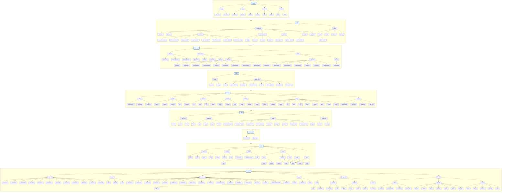

```mermaid
flowchart LR
    classDef root fill:#e8f0fe,stroke:#1a73e8,stroke-width:3px
    classDef truncation fill:#f5f5f5,stroke:#9e9e9e,stroke-dasharray:5 5
    subgraph nb0["Aspect"]
        n0["Aspect"]
        n1["Harmonic"]
        n2["Nature"]
        n3["Focal Body"]
        n4["Phase"]
        n5["Compound"]
        n6["Simple"]
        n45["Harmonic 4"]
        n46["Harmonic 12"]
        n47["Harmonic 11"]
        n48["Harmonic 5"]
        n49["Harmonic 9"]
        n50["Harmonic 10"]
        n51["Harmonic 6"]
        n52["Harmonic 8"]
        n53["Harmonic 1"]
        n54["Harmonic 7"]
        n55["Harmonic 2"]
        n56["Harmonic 3"]
        n57["Hard"]
        n58["Neutral"]
        n59["Soft"]
        n60["Chiron Focal"]
        n61["Venus Focal"]
        n62["Moon Focal"]
        n63["Ceres Focal"]
        n64["Juno Focal"]
        n65["Jupiter Focal"]
        n66["Saturn Focal"]
        n67["Neptune Focal"]
        n68["Uranus Focal"]
        n69["Pluto Focal"]
        n70["Lunar Apogee Focal"]
        n71["Lilith Focal"]
        n72["Pallas Focal"]
        n73["Mercury Focal"]
        n74["Mars Focal"]
        n75["Sun Focal"]
        n76["North Lunar Node Focal"]
        n77["Vesta Focal"]
        n78["Forming"]
        n79["Dissolving"]
        n80["Exact"]
        n92["Triple"]
        n93["Quadruple"]
        n94["Stellium"]
        n95["Sextuple"]
        n106["Minor"]
        n107["Specialty"]
        n108["Major"]
        n203["T Square"]
        n204["Yod"]
        n205["Grand Trine"]
        n206["Grand Cross"]
        n207["Kite"]
        n208["Quincunx"]
        n209["Sesquiquadrate"]
        n210["Semisquare"]
        n211["Semisextile"]
        n212["Undecile"]
        n213["Quintile"]
        n214["Novile"]
        n215["Tredecile"]
        n216["Septile"]
        n217["Decile"]
        n218["Biquintile"]
        n219["Square"]
        n220["Sextile"]
        n221["Conjunct"]
        n222["Opposite"]
        n223["Trine"]
        n224["4 Body"]
        n225["5 Body"]
        n226["6 Body"]
        n227["7 Body"]
        n261["Hexagram"]
        n0 --> n1
        n0 --> n2
        n0 --> n3
        n0 --> n4
        n0 --> n5
        n0 --> n6
        n1 --> n45
        n1 --> n46
        n1 --> n47
        n1 --> n48
        n1 --> n49
        n1 --> n50
        n1 --> n51
        n1 --> n52
        n1 --> n53
        n1 --> n54
        n1 --> n55
        n1 --> n56
        n2 --> n57
        n2 --> n58
        n2 --> n59
        n3 --> n60
        n3 --> n61
        n3 --> n62
        n3 --> n63
        n3 --> n64
        n3 --> n65
        n3 --> n66
        n3 --> n67
        n3 --> n68
        n3 --> n69
        n3 --> n70
        n3 --> n71
        n3 --> n72
        n3 --> n73
        n3 --> n74
        n3 --> n75
        n3 --> n76
        n3 --> n77
        n4 --> n78
        n4 --> n79
        n4 --> n80
        n5 --> n92
        n5 --> n93
        n5 --> n94
        n5 --> n95
        n6 --> n106
        n6 --> n107
        n6 --> n108
        n92 --> n203
        n92 --> n204
        n92 --> n205
        n93 --> n206
        n93 --> n207
        n106 --> n208
        n106 --> n209
        n106 --> n210
        n106 --> n211
        n107 --> n212
        n107 --> n213
        n107 --> n214
        n107 --> n215
        n107 --> n216
        n107 --> n217
        n107 --> n218
        n108 --> n219
        n108 --> n220
        n108 --> n221
        n108 --> n222
        n108 --> n223
        n94 --> n224
        n94 --> n225
        n94 --> n226
        n94 --> n227
        n95 --> n261
    end
    subgraph nb1["Body"]
        n7["Body"]
        n8["Asteroid"]
        n9["Luminary"]
        n10["Point"]
        n11["Planet"]
        n12["Benefic"]
        n13["Malefic"]
        n81["Chiron"]
        n82["Juno"]
        n83["Ceres"]
        n84["Vesta"]
        n85["Pallas"]
        n86["Moon"]
        n87["Sun"]
        n88["Outer"]
        n89["Pluto"]
        n90["Uranus"]
        n91["Neptune"]
        n96["Personal"]
        n97["Venus"]
        n98["Mars"]
        n99["Mercury"]
        n100["Social"]
        n101["Jupiter"]
        n102["Saturn"]
        n103["Lunar Apogee"]
        n104["North Lunar Node"]
        n105["Lilith"]
        n7 --> n8
        n7 --> n9
        n7 --> n10
        n7 --> n11
        n7 --> n12
        n7 --> n13
        n8 --> n81
        n8 --> n82
        n8 --> n83
        n8 --> n84
        n8 --> n85
        n9 --> n86
        n9 --> n87
        n88 --> n89
        n88 --> n90
        n88 --> n91
        n96 --> n97
        n96 --> n98
        n96 --> n99
        n100 --> n101
        n100 --> n102
        n10 --> n103
        n10 --> n104
        n10 --> n105
        n11 --> n88
        n11 --> n96
        n11 --> n100
        n12 --> n97
        n12 --> n101
        n13 --> n98
        n13 --> n102
    end
    subgraph nb2["Temporality"]
        n14["Temporality"]
        n15["Perfective"]
        n16["Progressive"]
        n14 --> n15
        n14 --> n16
    end
    subgraph nb3["Daily"]
        n17["Daily"]
        n18["Solar Cycle"]
        n19["Lunar Cycle"]
        n20["Twilight"]
        n21["Time of Day"]
        n109["Nadir"]
        n110["Rise"]
        n111["Zenith"]
        n112["Set"]
        n146["Set"]
        n147["Nadir"]
        n148["Rise"]
        n149["Zenith"]
        n150["Astronomical Dawn"]
        n151["Astronomical Twilight"]
        n152["Nautical Dawn"]
        n153["Nautical Twilight"]
        n154["Civil Dawn"]
        n155["Daylight"]
        n156["Civil Dusk"]
        n157["Nautical Dusk"]
        n158["Astronomical Dusk"]
        n159["Night"]
        n160["Morning"]
        n161["Evening"]
        n17 --> n18
        n17 --> n19
        n17 --> n20
        n17 --> n21
        n18 --> n109
        n18 --> n110
        n18 --> n111
        n18 --> n112
        n19 --> n146
        n19 --> n147
        n19 --> n148
        n19 --> n149
        n20 --> n150
        n20 --> n151
        n20 --> n152
        n20 --> n153
        n20 --> n154
        n20 --> n155
        n20 --> n156
        n20 --> n157
        n20 --> n158
        n20 --> n159
        n21 --> n160
        n21 --> n161
    end
    subgraph nb4["Zodiac"]
        n22["Zodiac"]
        n23["Decan"]
        n24["Dignity"]
        n25["Element"]
        n26["Modality"]
        n27["Polarity"]
        n28["Sign"]
        n29["Ingress"]
        n113["Second Decan"]
        n114["Third Decan"]
        n115["First Decan"]
        n116["Peregrine"]
        n117["Domicile"]
        n118["Exaltation"]
        n119["Fall"]
        n120["Detriment"]
        n121["Air"]
        n122["Earth"]
        n123["Fire"]
        n124["Water"]
        n125["Mutable"]
        n126["Cardinal"]
        n127["Fixed"]
        n128["Positive"]
        n129["Negative"]
        n130["Gemini"]
        n131["Capricorn"]
        n132["Sagittarius"]
        n133["Cancer"]
        n134["Leo"]
        n135["Virgo"]
        n136["Libra"]
        n137["Scorpio"]
        n138["Aquarius"]
        n139["Aries"]
        n140["Pisces"]
        n141["Taurus"]
        n142["Decan Ingress"]
        n143["Peak Ingress"]
        n144["Sign Ingress"]
        n145["Sign Transit"]
        n22 --> n23
        n22 --> n24
        n22 --> n25
        n22 --> n26
        n22 --> n27
        n22 --> n28
        n22 --> n29
        n23 --> n113
        n23 --> n114
        n23 --> n115
        n24 --> n116
        n24 --> n117
        n24 --> n118
        n24 --> n119
        n24 --> n120
        n25 --> n121
        n25 --> n122
        n25 --> n123
        n25 --> n124
        n26 --> n125
        n26 --> n126
        n26 --> n127
        n27 --> n128
        n27 --> n129
        n28 --> n130
        n28 --> n131
        n28 --> n132
        n28 --> n133
        n28 --> n134
        n28 --> n135
        n28 --> n136
        n28 --> n137
        n28 --> n138
        n28 --> n139
        n28 --> n140
        n28 --> n141
        n29 --> n142
        n29 --> n143
        n29 --> n144
        n29 --> n145
    end
    subgraph nb5["Lunar"]
        n30["Lunar"]
        n31["Apsides"]
        n32["Monthly Cycle"]
        n162["Perigee"]
        n163["Apogee"]
        n167["Full"]
        n168["Waning Gibbous"]
        n169["Last Quarter"]
        n170["Waning Crescent"]
        n171["New"]
        n172["Waxing Crescent"]
        n173["First Quarter"]
        n174["Waxing Gibbous"]
        n30 --> n31
        n30 --> n32
        n31 --> n162
        n31 --> n163
        n32 --> n167
        n32 --> n168
        n32 --> n169
        n32 --> n170
        n32 --> n171
        n32 --> n172
        n32 --> n173
        n32 --> n174
    end
    subgraph nb6["Planetary"]
        n33["Planetary"]
        n34["Direction"]
        n35["Synodic Stage"]
        n36["Phase"]
        n164["Station Direct"]
        n165["Station Retrograde"]
        n166["Retrograde Period"]
        n182["Rise and set"]
        n183["Visibility"]
        n184["Elongation"]
        n185["Brightest"]
        n186["Mercurian"]
        n187["Venusian"]
        n188["Martian"]
        n228["Morning Set"]
        n229["Evening Rise"]
        n230["Evening Visibility"]
        n231["Eastern Elongation"]
        n232["Evening Set"]
        n233["Morning Rise"]
        n234["Morning Visibility"]
        n235["Western Elongation"]
        n236["Western Brightest"]
        n245["Evening Rise"]
        n246["Evening Visibility"]
        n247["Eastern Elongation"]
        n248["Eastern Brightest"]
        n249["Evening Set"]
        n250["Morning Rise"]
        n251["Western Brightest"]
        n252["Morning Rise"]
        n33 --> n34
        n33 --> n35
        n33 --> n36
        n34 --> n164
        n34 --> n165
        n34 --> n166
        n35 --> n182
        n35 --> n183
        n35 --> n184
        n35 --> n185
        n36 --> n186
        n36 --> n187
        n36 --> n188
        n186 --> n228
        n186 --> n229
        n186 --> n230
        n186 --> n231
        n186 --> n232
        n186 --> n233
        n186 --> n234
        n186 --> n235
        n186 --> n236
        n187 --> n245
        n187 --> n246
        n187 --> n247
        n187 --> n248
        n187 --> n249
        n187 --> n250
        n187 --> n251
        n188 --> n252
    end
    subgraph nb7["Solar"]
        n37["Solar"]
        n38["Annual Cycle"]
        n39["Season"]
        n175["Perihelion"]
        n176["Retreating"]
        n177["Hexadecan"]
        n178["Cross-Quarter Day"]
        n179["Equinox"]
        n180["Solstice"]
        n181["Aphelion"]
        n189["Winter"]
        n190["Spring"]
        n191["Summer"]
        n192["Autumn"]
        n237["Thirteenth Hexadecan"]
        n238["Fifteenth Hexadecan"]
        n239["First Hexadecan"]
        n240["Third Hexadecan"]
        n241["Fifth Hexadecan"]
        n242["Seventh Hexadecan"]
        n243["Ninth Hexadecan"]
        n244["Eleventh Hexadecan"]
        n253["Imbolc"]
        n254["Beltane"]
        n255["Lammas"]
        n256["Samhain"]
        n257["Vernal Equinox"]
        n258["Autumnal Equinox"]
        n259["Summer Solstice"]
        n260["Winter Solstice"]
        n37 --> n38
        n37 --> n39
        n38 --> n175
        n38 --> n176
        n38 --> n177
        n38 --> n178
        n38 --> n179
        n38 --> n180
        n38 --> n181
        n39 --> n189
        n39 --> n190
        n39 --> n191
        n39 --> n192
        n177 --> n237
        n177 --> n238
        n177 --> n239
        n177 --> n240
        n177 --> n241
        n177 --> n242
        n177 --> n243
        n177 --> n244
        n178 --> n253
        n178 --> n254
        n178 --> n255
        n178 --> n256
        n179 --> n257
        n179 --> n258
        n180 --> n259
        n180 --> n260
    end
    subgraph nb8["Eclipse"]
        n40["Eclipse"]
        n41["Frame"]
        n42["Phase"]
        n43["Solar"]
        n44["Lunar"]
        n193["Geocentric"]
        n194["Topocentric"]
        n195["Beginning"]
        n196["Maximum"]
        n197["Ending"]
        n198["Annular"]
        n199["Total"]
        n200["Partial"]
        n201["Total"]
        n202["Partial"]
        n40 --> n41
        n40 --> n42
        n40 --> n43
        n40 --> n44
        n41 --> n193
        n41 --> n194
        n42 --> n195
        n42 --> n196
        n42 --> n197
        n43 --> n198
        n43 --> n199
        n43 --> n200
        n44 --> n201
        n44 --> n202
    end
    class n0 root
    class n7 root
    class n14 root
    class n17 root
    class n22 root
    class n30 root
    class n33 root
    class n37 root
    class n40 root
```
