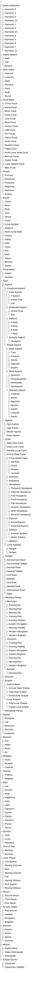

```mermaid
treeView-beta
    "Aspect Harmonic/"
        "Harmonic 4"
        "Harmonic 3"
        "Harmonic 6"
        "Harmonic 12"
        "Harmonic 1"
        "Harmonic 2"
        "Harmonic 10"
        "Harmonic 9"
        "Harmonic 5"
        "Harmonic 8"
        "Harmonic 7"
        "Harmonic 11"
    "Aspect Nature/"
        "Hard"
        "Soft"
        "Neutral"
    "Body Class/"
        "Asteroid"
        "Luminary"
        "Outer"
        "Personal"
        "Point"
        "Node"
        "Social"
    "Focal Body/"
        "Chiron Focal"
        "Venus Focal"
        "Moon Focal"
        "Ceres Focal"
        "Juno Focal"
        "Pluto Focal"
        "Uranus Focal"
        "Lilith Focal"
        "Sun Focal"
        "Saturn Focal"
        "Vesta Focal"
        "Neptune Focal"
        "Pallas Focal"
        "North Lunar Node Focal"
        "Mercury Focal"
        "Jupiter Focal"
        "Lunar Apogee Focal"
        "Mars Focal"
    "Phase/"
        "Forming"
        "Dissolving"
        "Perfective"
        "Beginning"
        "Maximum"
        "Ending"
    "Planet/"
        "Chiron"
        "Moon"
        "Pluto"
        "Juno"
        "Venus"
        "Ceres"
        "Lunar Apogee"
        "Neptune"
        "North Lunar Node"
        "Uranus"
        "Pallas"
        "Lilith"
        "Vesta"
        "Sun"
        "Mars"
        "Saturn"
        "Mercury"
        "Jupiter"
    "Temporality/"
        "Instant"
        "Duration"
    "Type/"
        "Aspect/"
            "Compound Aspect/"
                "Triple Aspect/"
                    "T Square"
                    "Grand Trine"
                    "Yod"
                "Quadruple Aspect/"
                    "Grand Cross"
                    "Kite"
                "Stellium/"
                    "4 Body"
                    "5 Body"
                    "6 Body"
                    "7 Body"
                "Sextuple Aspect/"
                    "Hexagram"
            "Simple Aspect/"
                "Major Aspect/"
                    "Trine"
                    "Conjunct"
                    "Sextile"
                    "Opposite"
                    "Square"
                "Minor Aspect/"
                    "Quincunx"
                    "Sesquiquadrate"
                    "Semisextile"
                    "Semisquare"
                "Specialty Aspect/"
                    "Tredecile"
                    "Novile"
                    "Biquintile"
                    "Quintile"
                    "Septile"
                    "Undecile"
                    "Decile"
        "Ingress/"
            "Sign Ingress"
            "Sign Transit"
            "Decan Ingress"
            "Peak Ingress"
        "Cycle/"
            "Daily Solar Cycle"
            "Daily Lunar Cycle"
            "Monthly Lunar Cycle"
            "Annual Solar Cycle/"
                "Cross-Quarter Day/"
                    "Samhain"
                    "Imbolc"
                    "Beltane"
                    "Lammas"
                "Perihelion"
                "Retreating"
                "Hexadecan/"
                    "Thirteenth Hexadecan"
                    "Fifteenth Hexadecan"
                    "First Hexadecan"
                    "Third Hexadecan"
                    "Fifth Hexadecan"
                    "Seventh Hexadecan"
                    "Ninth Hexadecan"
                    "Eleventh Hexadecan"
                "Equinox/"
                    "Vernal Equinox"
                    "Autumnal Equinox"
                "Solstice/"
                    "Summer Solstice"
                    "Winter Solstice"
                "Aphelion"
            "Lunar Apsides/"
                "Apogee"
                "Perigee"
        "Twilight/"
            "Astronomical Dawn"
            "Astronomical Twilight"
            "Nautical Dawn"
            "Nautical Twilight"
            "Civil Dawn"
            "Daylight"
            "Civil Dusk"
            "Nautical Dusk"
            "Astronomical Dusk"
            "Night"
        "Planetary Phase/"
            "Mercurian/"
                "Evening Set"
                "Morning Rise"
                "Morning Set"
                "Evening Rise"
                "Evening Visibility"
                "Eastern Elongation"
                "Morning Visibility"
                "Western Elongation"
                "Western Brightest"
            "Venusian/"
                "Evening Rise"
                "Evening Visibility"
                "Eastern Elongation"
                "Eastern Brightest"
                "Evening Set"
                "Morning Rise"
                "Western Brightest"
            "Martian/"
                "Morning Rise"
        "Direction"
        "Eclipse/"
            "Solar Eclipse/"
                "Annular Solar Eclipse"
                "Total Solar Eclipse"
                "Partial Solar Eclipse"
            "Lunar Eclipse/"
                "Total Lunar Eclipse"
                "Partial Lunar Eclipse"
        "Retrograde Period"
    "Dignity/"
        "Peregrine"
        "Fall"
        "Detriment"
        "Domicile"
        "Exaltation"
    "Element/"
        "Fire"
        "Water"
        "Earth"
        "Air"
    "Modality/"
        "Fixed"
        "Mutable"
        "Cardinal"
    "Polarity/"
        "Positive"
        "Negative"
    "Sign/"
        "Leo"
        "Scorpio"
        "Virgo"
        "Sagittarius"
        "Aries"
        "Libra"
        "Capricorn"
        "Gemini"
        "Cancer"
        "Aquarius"
        "Pisces"
        "Taurus"
    "Domain/"
        "Solar"
        "Lunar"
        "Planetary"
    "Time of Day/"
        "Morning"
        "Evening"
    "Lunar Phase/"
        "Last Quarter"
        "Waning Crescent"
        "New"
        "Waxing Crescent"
        "Full"
        "Waning Gibbous"
        "First Quarter"
        "Waxing Gibbous"
    "Decan/"
        "Second Decan"
        "Third Decan"
        "First Decan"
    "Synodic Stage/"
        "Rise and set"
        "Visibility"
        "Elongation"
        "Brightest"
    "Season/"
        "Autumn"
        "Winter"
        "Spring"
        "Summer"
    "Motion/"
        "Station Direct"
        "Station Retrograde"
        "Retrograde"
    "Eclipse Frame/"
        "Geocentric"
        "Topocentric Visibility"
```
