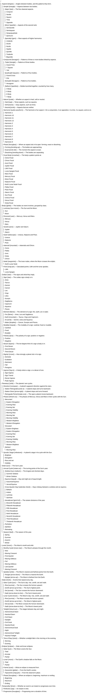

```mermaid
treeView-beta
    "Aspect/ [shapes] — Angles between bodies, and the patterns they form."
        "Simple/ [triangle] — Aspects between two bodies."
            "Major/ [star] — The five classical aspects."
                "Conjunct"
                "Sextile"
                "Square"
                "Trine"
                "Opposite"
            "Minor/ [sparkle] — Aspects of the second rank."
                "Semisextile"
                "Semisquare"
                "Sesquiquadrate"
                "Quincunx"
            "Specialty/ [gem] — Rare aspects of higher harmonics."
                "Undecile"
                "Decile"
                "Novile"
                "Septile"
                "Quintile"
                "Tredecile"
                "Biquintile"
        "Compound/ [hexagon] — Patterns of three or more bodies linked by aspects."
            "Triple/ [triangle] — Patterns of three bodies."
                "Grand Trine"
                "T Square"
                "Yod"
            "Quadruple/ [square] — Patterns of four bodies."
                "Grand Cross"
                "Kite"
            "Sextuple/ [hexagon] — Patterns of six bodies."
                "Hexagram"
            "Stellium/ [sparkles] — Bodies bunched together, counted by how many."
                "4 Body"
                "5 Body"
                "6 Body"
                "7 Body"
        "Nature/ [scale] — Whether an aspect is hard, soft or neutral."
            "Hard [zap] — Tense aspects, such as squares."
            "Soft [waves] — Easy aspects, such as trines."
            "Neutral [circle] — Aspects that are neither."
        "Harmonic/ [audio-waveform] — The harmonic of an aspect: 1 for a conjunction, 2 an opposition, 3 a trine, 4 a square, and so on."
            "Harmonic 1"
            "Harmonic 10"
            "Harmonic 11"
            "Harmonic 12"
            "Harmonic 2"
            "Harmonic 3"
            "Harmonic 4"
            "Harmonic 5"
            "Harmonic 6"
            "Harmonic 7"
            "Harmonic 8"
            "Harmonic 9"
        "Phase/ [hourglass] — Where an aspect sits in its span: forming, exact or dissolving."
            "Forming [trending-up] — The bodies are approaching."
            "Exact [circle-dot] — The moment the aspect is exact."
            "Dissolving [trending-down] — The bodies are separating."
        "Focal Body/ [crosshair] — The body a pattern points at."
            "Ceres Focal"
            "Chiron Focal"
            "Juno Focal"
            "Jupiter Focal"
            "Lilith Focal"
            "Lunar Apogee Focal"
            "Mars Focal"
            "Mercury Focal"
            "Moon Focal"
            "Neptune Focal"
            "North Lunar Node Focal"
            "Pallas Focal"
            "Pluto Focal"
            "Saturn Focal"
            "Sun Focal"
            "Uranus Focal"
            "Venus Focal"
            "Vesta Focal"
    "Body/ [globe] — The bodies an event involves, grouped by class."
        "Luminary/ [sun-moon] — The Sun and the Moon."
            "Sun"
            "Moon"
        "Personal/ [user] — Mercury, Venus and Mars."
            "Mercury"
            "Venus"
            "Mars"
        "Social/ [users] — Jupiter and Saturn."
            "Jupiter"
            "Saturn"
        "Outer/ [telescope] — Uranus, Neptune and Pluto."
            "Uranus"
            "Neptune"
            "Pluto"
        "Asteroid/ [mountain] — Asteroids and Chiron."
            "Ceres"
            "Pallas"
            "Juno"
            "Vesta"
            "Chiron"
        "Node/ [waypoints] — The lunar nodes, where the Moon crosses the ecliptic."
            "North Lunar Node"
        "Point/ [map-pin] — Calculated points: Lilith and the lunar apsides."
            "Lilith"
            "Lunar Apogee"
    "Zodiac/ [star] — The signs and what they imply."
        "Sign/ [star] — The zodiac sign a body is in."
            "Aries"
            "Taurus"
            "Gemini"
            "Cancer"
            "Leo"
            "Virgo"
            "Libra"
            "Scorpio"
            "Sagittarius"
            "Capricorn"
            "Aquarius"
            "Pisces"
        "Element/ [flame] — The element of a sign: fire, earth, air or water."
            "Fire [flame] — Aries, Leo and Sagittarius."
            "Earth [mountain] — Taurus, Virgo and Capricorn."
            "Air [wind] — Gemini, Libra and Aquarius."
            "Water [droplets] — Cancer, Scorpio and Pisces."
        "Modality/ [repeat] — The modality of a sign: cardinal, fixed or mutable."
            "Cardinal"
            "Fixed"
            "Mutable"
        "Polarity/ [plus] — The polarity of a sign: positive or negative."
            "Positive"
            "Negative"
        "Decan/ [layers] — The ten-degree third of a sign a body is in."
            "First Decan"
            "Second Decan"
            "Third Decan"
        "Dignity/ [crown] — How strongly a planet sits in its sign."
            "Domicile"
            "Exaltation"
            "Detriment"
            "Fall"
            "Peregrine"
        "Ingress/ [log-in] — A body enters a sign, or a decan of one."
            "Sign Ingress"
            "Sign Transit"
            "Decan Ingress"
            "Peak Ingress"
    "Planetary/ [orbit] — The planets' own cycles."
        "Direction/ [compass] — A planet's apparent direction against the stars."
            "Station Retrograde [undo-2] — A planet stops and turns backward."
            "Station Direct [arrow-right] — A planet stops and turns forward."
            "Retrograde Period [rotate-ccw] — The span a planet moves backward."
        "Phase/ [refresh-cw] — The phases of Mercury, Venus and Mars in their cycles with the Sun."
            "Mercurian/"
                "Eastern Elongation"
                "Evening Rise"
                "Evening Set"
                "Evening Visibility"
                "Morning Rise"
                "Morning Set"
                "Morning Visibility"
                "Western Brightest"
                "Western Elongation"
            "Venusian/"
                "Eastern Brightest"
                "Eastern Elongation"
                "Evening Rise"
                "Evening Set"
                "Evening Visibility"
                "Morning Rise"
                "Western Brightest"
            "Martian/"
                "Morning Rise"
        "Synodic Stage/ [milestone] — A planet's stage in its cycle with the Sun."
            "Brightest"
            "Elongation"
            "Rise and set"
            "Visibility"
    "Solar/ [sun] — The Sun's year."
        "Annual Cycle/ [rotate-cw] — The turning points of the Sun's year."
            "Solstice/ [sun-medium] — The longest and shortest days."
                "Summer Solstice"
                "Winter Solstice"
            "Equinox/ [equal] — Day and night are of equal length."
                "Autumnal Equinox"
                "Vernal Equinox"
            "Cross-Quarter Day/ [calendar-check] — Days midway between a solstice and an equinox."
                "Beltane"
                "Imbolc"
                "Lammas"
                "Samhain"
            "Hexadecan/ [grid-2x2] — The sixteen divisions of the year."
                "Eleventh Hexadecan"
                "Fifteenth Hexadecan"
                "Fifth Hexadecan"
                "First Hexadecan"
                "Ninth Hexadecan"
                "Seventh Hexadecan"
                "Third Hexadecan"
                "Thirteenth Hexadecan"
            "Perihelion"
            "Aphelion"
            "Retreating"
        "Season/ [leaf] — The season of the year."
            "Spring"
            "Summer"
            "Autumn"
            "Winter"
    "Lunar/ [moon] — The Moon's month and orbit."
        "Monthly Cycle/ [moon-star] — The Moon's phases through the month."
            "New"
            "Waxing Crescent"
            "First Quarter"
            "Waxing Gibbous"
            "Full"
            "Waning Gibbous"
            "Last Quarter"
            "Waning Crescent"
        "Apsides/ [orbit] — The Moon's nearest and farthest points from the Earth."
            "Perigee [arrow-down] — The Moon is nearest the Earth."
            "Apogee [arrow-up] — The Moon is farthest from the Earth."
    "Daily/ [clock] — Events that repeat every day."
        "Solar Cycle/ [sun] — The Sun's day: rise, zenith, set and nadir."
            "Rise [sunrise] — The Sun crosses the horizon upward."
            "Zenith [arrow-up-to-line] — The Sun's highest point."
            "Set [sunset] — The Sun crosses the horizon downward."
            "Nadir [arrow-down-to-line] — The Sun's lowest point."
        "Lunar Cycle/ [moon] — The Moon's day: rise, zenith, set and nadir."
            "Rise [sunrise] — The Moon crosses the horizon upward."
            "Zenith [arrow-up-to-line] — The Moon's highest point."
            "Set [sunset] — The Moon crosses the horizon downward."
            "Nadir [arrow-down-to-line] — The Moon's lowest point."
        "Twilight/ [cloud-sun] — The stages between day and night."
            "Astronomical Dawn"
            "Nautical Dawn"
            "Civil Dawn"
            "Daylight"
            "Civil Dusk"
            "Nautical Dusk"
            "Astronomical Dusk"
            "Night"
            "Astronomical Twilight"
            "Nautical Twilight"
        "Time of Day/ [clock] — Whether a twilight falls in the morning or the evening."
            "Morning"
            "Evening"
    "Eclipse/ [eclipse] — Solar and lunar eclipses."
        "Solar/ [sun] — The Moon covers the Sun."
            "Total"
            "Annular"
            "Partial"
        "Lunar/ [moon] — The Earth's shadow falls on the Moon."
            "Total"
            "Partial"
        "Frame/ [scan] — What an eclipse is measured from."
            "Geocentric [globe] — From the Earth's center."
            "Topocentric [map-pin] — From the observer's place."
        "Phase/ [hourglass] — Where an eclipse is: beginning, maximum or ending."
            "Beginning"
            "Maximum"
            "Ending"
    "Temporality/ [timer] — Whether an event is an instant or progresses over time."
        "Perfective [zap] — An instant in time."
        "Progressive [hourglass] — Progressing over a duration of time."
```
