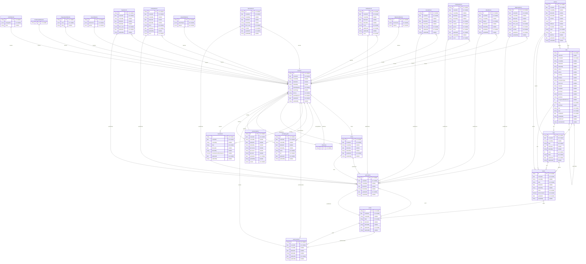

# LexicoDb Entity Relationship Diagram

<!-- postgresql-erd:start -->

```mermaid
erDiagram
  AdjectivalForm }o--|| lexemes : lexeme
  AdjectivalForm ||--o{ word_forms : wordForms
  AdjectiveInflection ||--|| lexemes : lexeme
  AdverbForm }o--|| lexemes : lexeme
  AdverbForm ||--o{ word_forms : wordForms
  AdverbInflection ||--|| lexemes : lexeme
  authors ||--o{ texts : texts
  FiniteVerbForm }o--|| lexemes : lexeme
  FiniteVerbForm ||--o{ word_forms : wordForms
  forms }o--|| lexemes : lexeme
  forms ||--o{ word_forms : wordForms
  GerundForm }o--|| lexemes : lexeme
  GerundForm ||--o{ word_forms : wordForms
  InfinitiveForm }o--|| lexemes : lexeme
  InfinitiveForm ||--o{ word_forms : wordForms
  inflections ||--|| lexemes : lexeme
  lexemes ||--o{ forms : forms
  lexemes ||--|| inflections : inflection
  lexemes ||--o{ principal_parts : principalParts
  lexemes ||--o{ pronunciations : pronunciations
  lexemes ||--o{ translations : translations
  lexemes ||--o{ word_lexemes : wordLexemes
  lines }o--|| authors : author
  lines }o--|| texts : text
  lines ||--o{ tokens : tokens
  NominalForm }o--|| lexemes : lexeme
  NominalForm ||--o{ word_forms : wordForms
  NounInflection ||--|| lexemes : lexeme
  ParticipleForm }o--|| lexemes : lexeme
  ParticipleForm ||--o{ word_forms : wordForms
  PrepositionInflection ||--|| lexemes : lexeme
  principal_parts }o--|| lexemes : lexeme
  pronunciations }o--|| lexemes : lexeme
  SupineForm }o--|| lexemes : lexeme
  SupineForm ||--o{ word_forms : wordForms
  texts }o--|| authors : author
  texts ||--o{ texts : childTexts
  texts ||--o{ lines : lines
  texts }o--|| texts : parentText
  tokens }o--|| authors : author
  tokens }o--|| lines : line
  tokens }o--|| texts : text
  tokens }o--|| words : word
  translations }o--|| lexemes : lexeme
  UninflectedInflection ||--|| lexemes : lexeme
  VerbInflection ||--|| lexemes : lexeme
  words ||--o{ word_forms : wordForms
  words ||--o{ word_lexemes : wordLexemes
  word_forms }o--|| forms : form
  word_forms }o--|| words : word
  word_lexemes }o--|| lexemes : lexeme
  word_lexemes }o--|| words : word
  AdjectivalForm {
    string id PK "not nullable"
    date createdAt "not nullable"
    string createdBy "nullable"
    date deletedAt "nullable"
    string deletedBy "nullable"
    enum form_case "not nullable"
    enum gender "not nullable"
    enum number "not nullable"
    date updatedAt "not nullable"
    string updatedBy "nullable"
  }
  AdjectiveInflection {
    string id PK "not nullable"
    enum declension "not nullable"
    enum degree "not nullable"
  }
  AdverbForm {
    string id PK "not nullable"
    date createdAt "not nullable"
    string createdBy "nullable"
    enum degree "not nullable"
    date deletedAt "nullable"
    string deletedBy "nullable"
    date updatedAt "not nullable"
    string updatedBy "nullable"
  }
  AdverbInflection {
    string id PK "not nullable"
    enum adverbType "not nullable"
    enum degree "not nullable"
  }
  authors {
    string id PK "not nullable"
    date createdAt "not nullable"
    string createdBy "nullable"
    date deletedAt "nullable"
    string deletedBy "nullable"
    int endYear "nullable"
    enum era "nullable"
    string fullName "nullable"
    json metadata "nullable"
    string name "not nullable"
    string slug "not nullable"
    int startYear "nullable"
    date updatedAt "not nullable"
    string updatedBy "nullable"
  }
  FiniteVerbForm {
    string id PK "not nullable"
    date createdAt "not nullable"
    string createdBy "nullable"
    date deletedAt "nullable"
    string deletedBy "nullable"
    enum mood "not nullable"
    enum number "not nullable"
    enum person "not nullable"
    enum tense "not nullable"
    date updatedAt "not nullable"
    string updatedBy "nullable"
    enum voice "not nullable"
  }
  forms {
    string id PK "not nullable"
    date createdAt "not nullable"
    string createdBy "nullable"
    date deletedAt "nullable"
    string deletedBy "nullable"
    date updatedAt "not nullable"
    string updatedBy "nullable"
  }
  GerundForm {
    string id PK "not nullable"
    date createdAt "not nullable"
    string createdBy "nullable"
    date deletedAt "nullable"
    string deletedBy "nullable"
    enum form_case "not nullable"
    date updatedAt "not nullable"
    string updatedBy "nullable"
  }
  InfinitiveForm {
    string id PK "not nullable"
    date createdAt "not nullable"
    string createdBy "nullable"
    date deletedAt "nullable"
    string deletedBy "nullable"
    enum tense "not nullable"
    date updatedAt "not nullable"
    string updatedBy "nullable"
    enum voice "not nullable"
  }
  inflections {
    string id PK "not nullable"
  }
  lexemes {
    string id PK "not nullable"
    date createdAt "not nullable"
    string createdBy "nullable"
    date deletedAt "nullable"
    string deletedBy "nullable"
    int disambiguator "not nullable"
    string etymology "nullable"
    string lemma "not nullable"
    enum partOfSpeech "not nullable"
    date updatedAt "not nullable"
    string updatedBy "nullable"
  }
  lines {
    string id PK "not nullable"
    date createdAt "not nullable"
    string createdBy "nullable"
    string data "not nullable"
    date deletedAt "nullable"
    string deletedBy "nullable"
    int index "not nullable"
    string label "not nullable"
    date updatedAt "not nullable"
    string updatedBy "nullable"
  }
  NominalForm {
    string id PK "not nullable"
    date createdAt "not nullable"
    string createdBy "nullable"
    date deletedAt "nullable"
    string deletedBy "nullable"
    enum form_case "not nullable"
    enum number "not nullable"
    date updatedAt "not nullable"
    string updatedBy "nullable"
  }
  NounInflection {
    string id PK "not nullable"
    enum declension "not nullable"
    enum gender "not nullable"
  }
  ParticipleForm {
    string id PK "not nullable"
    date createdAt "not nullable"
    string createdBy "nullable"
    date deletedAt "nullable"
    string deletedBy "nullable"
    enum tense "not nullable"
    date updatedAt "not nullable"
    string updatedBy "nullable"
    enum voice "not nullable"
  }
  PrepositionInflection {
    string id PK "not nullable"
    enum case "not nullable"
    string other "nullable"
  }
  principal_parts {
    string id PK "not nullable"
    date createdAt "not nullable"
    string createdBy "nullable"
    date deletedAt "nullable"
    string deletedBy "nullable"
    string name "not nullable"
    json text "not nullable"
    date updatedAt "not nullable"
    string updatedBy "nullable"
  }
  pronunciations {
    string id PK "not nullable"
    date createdAt "not nullable"
    string createdBy "nullable"
    date deletedAt "nullable"
    string deletedBy "nullable"
    string phonemes "nullable"
    string phonemic "nullable"
    string phonetic "nullable"
    date updatedAt "not nullable"
    string updatedBy "nullable"
    enum variant "not nullable"
  }
  SupineForm {
    string id PK "not nullable"
    date createdAt "not nullable"
    string createdBy "nullable"
    date deletedAt "nullable"
    string deletedBy "nullable"
    enum form_case "not nullable"
    date updatedAt "not nullable"
    string updatedBy "nullable"
  }
  texts {
    string id PK "not nullable"
    enum collection "nullable"
    date createdAt "not nullable"
    string createdBy "nullable"
    date deletedAt "nullable"
    string deletedBy "nullable"
    string edition "nullable"
    string editors "nullable"
    int endYear "nullable"
    string findSpot "nullable"
    string inscriptionType "nullable"
    int lineCount "nullable"
    string material "nullable"
    json metadata "nullable"
    int printYear "nullable"
    string province "nullable"
    string publisher "nullable"
    int recognisedWordCount "nullable"
    string slug "not nullable"
    int startYear "nullable"
    string title "not nullable"
    string type "not nullable"
    date updatedAt "not nullable"
    string updatedBy "nullable"
    int wordCount "nullable"
    string workIdentifier "nullable"
  }
  tokens {
    string id PK "not nullable"
    date createdAt "not nullable"
    string createdBy "nullable"
    string data "not nullable"
    date deletedAt "nullable"
    string deletedBy "nullable"
    int index "not nullable"
    boolean isPunctuation "not nullable"
    date updatedAt "not nullable"
    string updatedBy "nullable"
  }
  translations {
    string id PK "not nullable"
    date createdAt "not nullable"
    string createdBy "nullable"
    string data "not nullable"
    date deletedAt "nullable"
    string deletedBy "nullable"
    tsvector translationFullTextSearch "nullable"
    date updatedAt "not nullable"
    string updatedBy "nullable"
  }
  UninflectedInflection {
    string id PK "not nullable"
  }
  VerbInflection {
    string id PK "not nullable"
    enum conjugation "not nullable"
    string other "nullable"
  }
  words {
    string id PK "not nullable"
    date createdAt "not nullable"
    string createdBy "nullable"
    string data "not nullable"
    date deletedAt "nullable"
    string deletedBy "nullable"
    date updatedAt "not nullable"
    string updatedBy "nullable"
  }
  word_forms {
    string id PK "not nullable"
    date createdAt "not nullable"
    string createdBy "nullable"
    date deletedAt "nullable"
    string deletedBy "nullable"
    date updatedAt "not nullable"
    string updatedBy "nullable"
  }
  word_lexemes {
    string id PK "not nullable"
    date createdAt "not nullable"
    string createdBy "nullable"
    date deletedAt "nullable"
    string deletedBy "nullable"
    date updatedAt "not nullable"
    string updatedBy "nullable"
  }
```

<!-- postgresql-erd:end -->
